<div align = center>

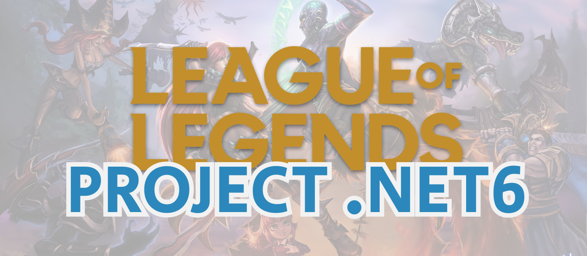

</div>

<div align = center>

---

[](https://codefirst.iut.uca.fr/sonar/dashboard?id=LolProjectIUT)
[](https://codefirst.iut.uca.fr/sonar/dashboard?id=LolProjectIUT)
[](https://codefirst.iut.uca.fr/sonar/dashboard?id=LolProjectIUT)
[](https://codefirst.iut.uca.fr/sonar/dashboard?id=LolProjectIUT)
[](https://codefirst.iut.uca.fr/sonar/dashboard?id=LolProjectIUT)
[](https://codefirst.iut.uca.fr/sonar/dashboard?id=LolProjectIUT)


---

</div>


**Thème du projet** : Réalisation d'une API Rest Full et d'un ORM (Entity Framework) qui seront reliés à une base de données (SQLite) dans le thème de League of Legends 
</br>


<u>La racine de mon GitLab contient deux dossiers :open_file_folder: essentiels pour le projet :</u>

[**src**](src) : **Toute la partie codage de l'application**

[**doc**](doc) : **Documentation de l'application** (Images + Schéma de l'architecture globale de l'application)

👉 [**Solution de l'application**](src/EntityFramework_LoL/Sources/LeagueOfLegends.sln)

👉 [**Solution de l'application pour la CI**](src/EntityFramework_LoL/Sources/LeagueOfLegendsCI.sln)


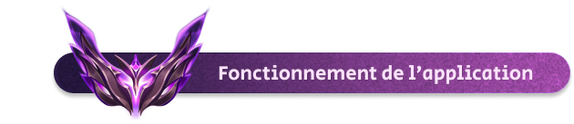

- ### :building_construction: Comment est structurée l'architecture globale de l'application ?

 Voici un **schéma** pour mieux représenter mon architecture :


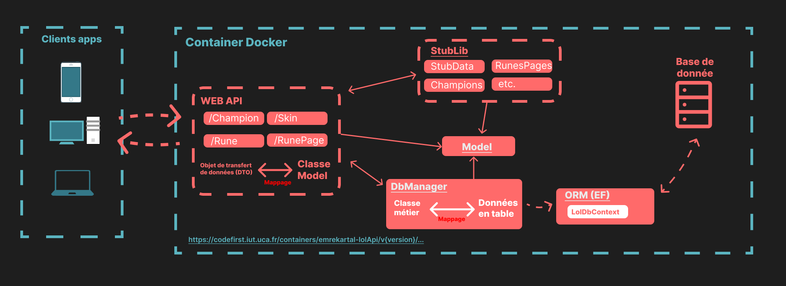

</br>
</br>

:information_source: Tout d'abord, il y a la partie client, qui correspond à tous les appareils :computer: qui vont effectuer des requêtes à mon API et recevoir, sous format *.json*:envelope: (JavaScript Object Notation), des informations sur des champions, des skins, etc.


La web API est chargée de transformer les classes métiers du modèle en DTO (Data Transfer Object), afin de filtrer et renvoyer seulement les données essentielles aux utilisateurs. Pour obtenir les données qu'elle va transmettre, elle utilise d'abord l'IDataManager du modèle, qui est hérité par le stub (:pushpin:un regroupement de fausses données qui permet de s'assurer que tout fonctionne et d'éviter de bloquer le développement), puis le DbManager, qui contactera la base de données et assurera la persistance des données.

Grâce à l'injection de dépendances dans le projet, la Web API n'a pas besoin d'être modifiée lorsqu'on veut passer du StubLib au DbManager (si vous ne savez pas ce que c'est, je vous invite à voir cette vidéo qui explique très clairement l'[Injection de dépendances](https://www.youtube.com/watch?v=OeWgBNR1BLU&t=10s&ab_channel=BaptisteMobileDev)).

La partie ```bases de données``` est gérée par le DbManager, qui utilise l'ORM Entity Framework (plus précisément le DbContext) pour récupérer les données dans la base de données. De plus, grâce à une factory :factory: (oui, comme celle de la web API), elle transforme les données en tables (appelées "Entities") en classes du modèle (et inversement).

Le client MAUI pourra effectuer des requêtes HTTP à l'API via l'API Manager, qui hérite de IDataManager et possède une liste de fonctions responsables d'exécuter les requêtes. De cette manière, le client n'aura pas besoin de connaître l'API pour interagir avec elle. :bulb:


- ### Comment récupérer le projet ? 

Tout d'abord, si ce n'est pas déjà fait, clonez le dépôt de la branche **master/main**. Pour ce faire, copiez le lien URL du dépôt git :

<div align = center>


</div>

Vous pouvez le cloner via un terminal dans le répertoire de votre choix en utilisant la commande : **git clone https://codefirst.iut.uca.fr/git/emre.kartal/LolProject.git**. Sinon, vous pouvez utiliser Visual Studio et cloner le dépôt en entrant le lien :

<div align = center>

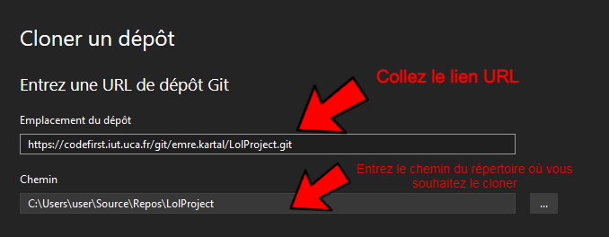

</div>

:information_source: *Si vous ne disposez pas de Visual Studio, allez sur le site [Microsoft Visual Studio](https://visualstudio.microsoft.com/fr/downloads/) pour pouvoir le télécharger !!!*

- ### Comment lancer l'API dotnet :question:

Pour pouvoir utiliser toutes les requêtes de l'API, il est nécessaire de récupérer le projet si cela n'a pas été fait, puis de le lancer à partir de Visual Studio. Vous pouvez directement cliquer sur la solution du projet. Ensuite, dans les projets de démarrage, choisissez **Api-Lol** :

<div align = center>

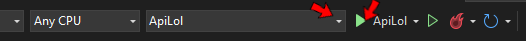

</div>

Normalement, tout est bon et vous serez redirigé vers Swagger, qui est l'interface graphique permettant d'effectuer facilement des requêtes. Il vous suffit ensuite de choisir la version en haut à droite. La ```version 2.0``` est normalement la plus récente et la plus performante en termes de gestion d'erreur :

<div align = center>

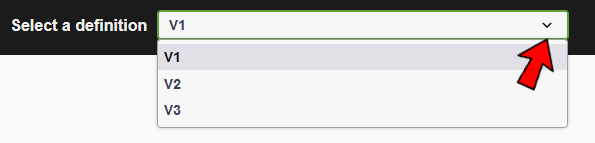

</div>

:paperclip: Vous pouvez aussi utiliser l'API via cette url: https://codefirst.iut.uca.fr/containers/emrekartal-lolApi/Api/v3/champions

- ### Comment lancer Le projet Entity Framework ? 

Afin de générer les migrations et les tables, vous devez avoir installé correctement EntityFrameworkCore. Pour cela il existe la commande : **dotnet tool install --global dotnet-ef**, qui peut être lancé à partir d'un terminal. Si elle est déjà installée mais n'a pas la bonne version : **dotnet tool update --global dotnet-ef** (oui, il n'y a que l'*install* qui change. Vous êtes perspicace !).

Assurez-vous également d'avoir installé les packages Nuget suivants sur Visual Studio au préalable :

<div align = center>

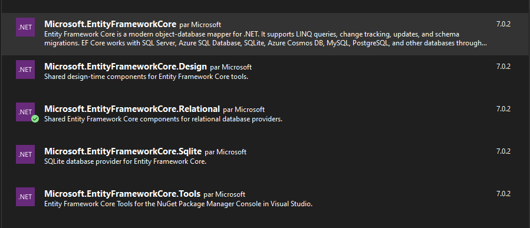

</div>

Ensuite, sur le terminal PowerShell ou Visual Studio, lancer la migration via la commande : **dotnet ef migrations add monNomDeMigration** (n'oubliez pas de vous situer dans le dossier **/MyFlib** lorsque vous l'exécutez)!

- ### Comment voir la base de données ?

```C'est bien beau toutes ces étapes, mais s’il n'y a pas de résultat, à quoi cela sert !```

Tout d'abord, veuillez regarder dans l'onglet Extensions si l'outil **SQLite and SQL Server Compact Toolbax** est bien installé.

Puis, afin de visualiser la migration dans la base de données, cliquer dans l'onglet **Outils**->**SQLLite/ SQL Server compact Toolbox** :

<div align = center>

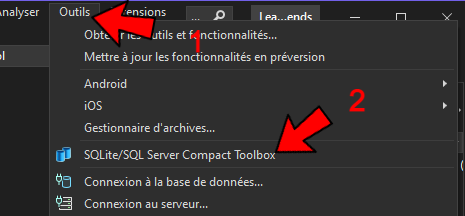

</div>

Et enfin cliquez sur l'icône ci-dessous pour établir la connexion à la solution en cours :

<div align = center>

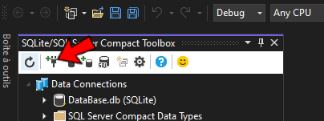

</div>

Vous pouvez désormais voir toutes les tables qui y sont enregistrées ! Si vous souhaitez ajouter des modifications à la base de données et les visualiser, 
réalisez à nouveau la migration (ou mettez à jour celle actuelle), puis supprimez toutes les tables et lancez la commande : **dotnet ef database update** et enfin rafraîchissez la base de données !

:information_source: *Notez qu'il est également possible, grâce à SQLLite, d'ajouter, modifier ou supprimer des données dans les tables.*

<br>

- ### Comment utiliser l'application MAUI ?

Si vous préférez éviter la manipulation de l'API, vous pouvez également utiliser le **client MAUI**. Celui-ci contacte directement l'ApiManager, qui se charge des requêtes HTTP à l'API, et vous permet de visualiser et de modifier les données grâce à une interface graphique.

Pour accomplir cela, veuillez configurer les propriétés de la solution en cliquant avec le bouton droit de la souris sur la solution, puis en sélectionnant "propriétés". De cette façon, vous pourrez lancer à la fois l'API et l'application League of Legends. Assurez-vous d'avoir les mêmes configurations :

<div align = center>

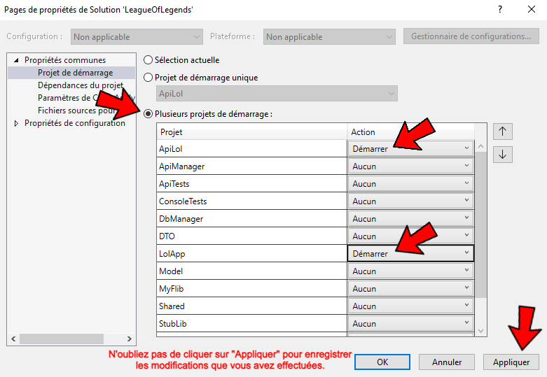

</div>

<u>Page **Home**:</u>

<div align = center>

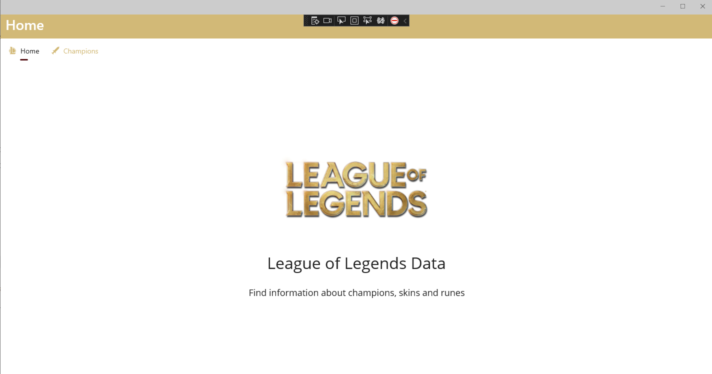

</div>

<u>Page **Champions**:</u>

<div align = center>


</div>

Vous pouvez vous amuser à filtrer les champions sur cette page, visualiser leurs skins, les modifier, et même en ajouter ! :grin:

:information_source: *Pour utiliser cette application, vous devez avoir la dernière version de Visual Studio, avoir effectué la migration auparavant (comme indiqué ci-dessus), et avoir sélectionné la solution **LeagueOfLegends** plutôt que **LeagueOfLegendsCi**. Si vous avez besoin d'aide ou si vous souhaitez obtenir plus d'informations, vous pouvez contacter le technicien responsable de l'application (c'est-à-dire moi), en vous référant à mon mail ci-dessous. :email: Notez également qu'il est capable de lancer l'application soit à partir de votre téléphone Android, soit via un émulateur !*


- ### Tests Unitaires :triangular_flag_on_post:

Afin de garantir un code de qualité avec le moins d'erreurs possible, j'ai pris soin de réaliser des tests unitaires tout au long de ce projet à l'aide de la bibliothèque **XUnit**. J'ai ensuite intégré ces tests à mon processus d'intégration continue (CI) via l'outil ```Drone```, ce qui m'a permis de détecter rapidement toute erreur ou anomalie tout au long du projet. L'utilisation de tests unitaires et d'une intégration continue a été essentielle pour garantir la qualité du code, améliorer la maintenabilité et réduire le temps nécessaire pour détecter et corriger les erreurs.:bug:

Toute la partie EF et API a été testée correctement. Cependant, le DbManager et l'ApiManager qui les utilisent n'ont pas été testés et ont été retirés de la couverture de code sur **SonarQube**. Voici la couverture de code actuelle de chaque partie (le 26/03/23) :

<div align = center>

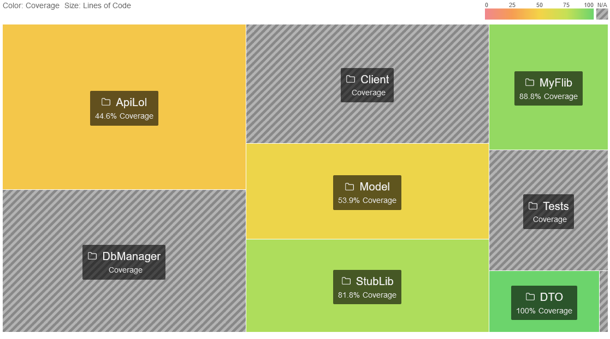

</div>

:information_source: *La partie API a été testée uniquement pour vérifier le bon fonctionnement de ses mécanismes de base. Cependant, je n'ai pas réalisé de tests pour vérifier les scénarios d'erreur possibles qui pourraient survenir lors de l'exécution de ces fonctions. De plus, la partie modèle et la bibliothèque Stublib ont été testées simultanément avec l'API.*

- ### Avancement du projet :construction_worker:

<u>Où en suis-je</u>:grey_question::grey_exclamation: (:white_check_mark: réalisé, :warning: presque abouti, :x: non commencé )


 Côté API :

- :white_check_mark: [**Partie 1**](src/EntityFramework_Lol/Sources/ApiLol/Controllers) : **Mise en place de toutes les opérations CRUD**

- :white_check_mark: [**Partie 2**](src/EntityFramework_Lol/Sources/ApiLol/Controllers) : **Respect des règles de routage, utilisation des bons status code**

- :white_check_mark: [**Partie 3**](src/EntityFramework_Lol/Sources/ApiLol/Controllers) : **Versionnage de l'api**

- :white_check_mark: [**Partie 4**](src/EntityFramework_Lol/Sources/Tests/ApiTests) : **Tests unitaires**

- :white_check_mark: [**Partie 5**](.drone.yml) : **Dockerisation et Hébergement de l'API**

- :white_check_mark: [**Partie 6**](src/EntityFramework_Lol/Sources/ApiLol/Controllers) : **Logs**

- :white_check_mark: [**Partie 7**](src/EntityFramework_Lol/Sources/ApiLol/Controllers) : **Filtrage + Pagination des données**

- :x: [**Partie 8**](src/EntityFramework_Lol/Sources/ApiLol/) : **Utilisation des fichiers configurations**

- :warning: [**Partie 9**](src/EntityFramework_Lol/Sources/) : **Réalisation du client MAUI et liaison avec l'api**

- :white_check_mark: [**Partie 10**](src/EntityFramework_Lol/Sources/ApiLol/) : **Liaison avec la base de données**

Côté Entity_Framework :

- :white_check_mark: [**Partie 1**](src/EntityFramework_Lol/Sources/MyFlib/Entities) : **Réalisation des Entities**

- :white_check_mark: [**Partie 2**](src/EntityFramework_Lol/Sources/MyFlib/DataSeeder.cs) : **Data seeder**

- :white_check_mark: [**Partie 3**](src/EntityFramework_Lol/Sources/Tests/UT_EF) : **Tests unitaires**

- :white_check_mark: [**Partie 4**](src/EntityFramework_Lol/Sources/MyFlib) : **Many to many**

- :white_check_mark: [**Partie 5**](src/EntityFramework_Lol/Sources/) : **DbManager**

- :white_check_mark: [**Partie 6**](src/EntityFramework_Lol/Sources/) : **Mapping**

Autre :

- :white_check_mark: [**Partie 1**](.drone.yml) : **Mise en place de SonarQube**

- :white_check_mark: [**Partie 2**](.drone.yml) : **Schéma et description de l'architecture globale de l'application**


Mon environnement de travail est basé sur un outil et un langage en particulier : 👇

<div align = center>

---

&nbsp; 
&nbsp; 
&nbsp; 
&nbsp; 

---

</div>

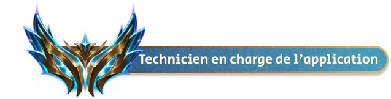

:mortar_board: **Emre KARTAL** - *Emre.kartal@etu.uca.fr*
<br>


<div align = center>
<a href = "https://codefirst.iut.uca.fr/git/emre.kartal">

</br>
</a>
© PM2
</div>

<hr>

<a rel="license" href="http://creativecommons.org/licenses/by-nc-nd/4.0/"></a><br />Ce(tte) œuvre est mise à disposition selon les termes de la <a rel="license" href="http://creativecommons.org/licenses/by-nc-nd/4.0/">Licence Creative Commons Attribution - Pas d&#39;Utilisation Commerciale - Pas de Modification 4.0 International</a>.

